# Setting up your keycloak web client.

Improperly configuring your Keycloak realm and client can result in frustrating application behavior that might be challenging to troubleshoot.. In this section we will look at the optimal configuration that works for fhir-web.

## _Version compatibility_

We have previously tested fhir-web on the following keycloak versions

- v18.0.0-legacy
- v19.0.3-legacy
- v22.0.5

## Keycloak config

The following instructions, including screenshots, assume that the Keycloak version is v19.0.3-legacy.

### Adding a realm

A complete openSRP FHIR end-to-end system will likely consist of multiple services, with FHIR-web being one of them. Each of these services should have an authentication client created within the same realm. Below, we'll explore how to add such a client for FHIR-web.

1. Login using keycloak's admin account.
2. On the account console below click on `Add realm`.
3. Add a realm name and click `create`

|                                                        |                                                      |
| ------------------------------------------------------ | ---------------------------------------------------- |
| 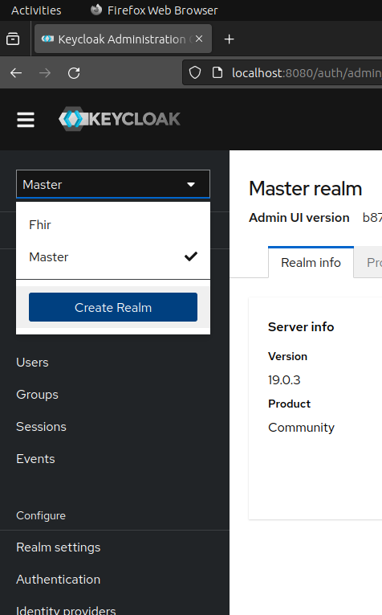 | 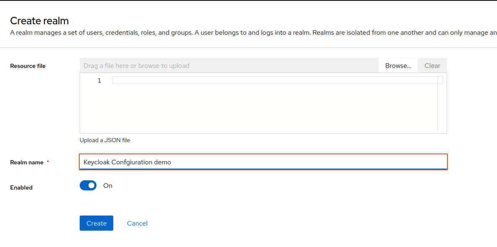 |

### Creating clients

Next we create the client that fhir-web will use to authenticate users.

1. On the left sidebar, click on `clients`.
2. This loads up a table with a few default clients that provide specific administrative purposes within the keycloak identity management system.
3. click on `Create client`,
4. fill in the client's id, and set the the capability config.
5. Next you will want to edit the following sections:
   1. `valid redirect URIs` - to whitelist AuthN redirection urls.
   2. `Valid post logout redirect URIs` - to enable logout flow completion
   3. `Web origins` - whitelist CORS
6. Save the client configuration.

|                                                        |                                                   |                                                                    |                                                          |
| ------------------------------------------------------ | ------------------------------------------------- | ------------------------------------------------------------------ | -------------------------------------------------------- |
| 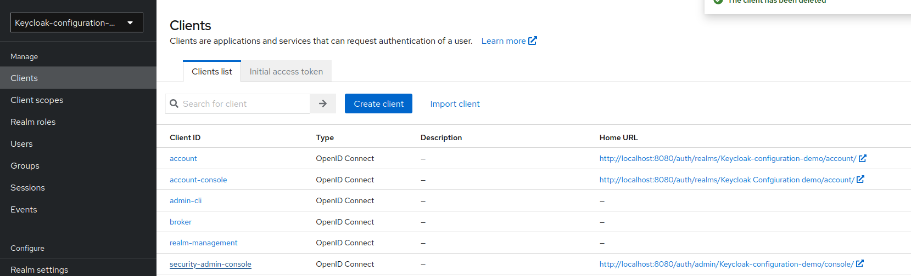 | 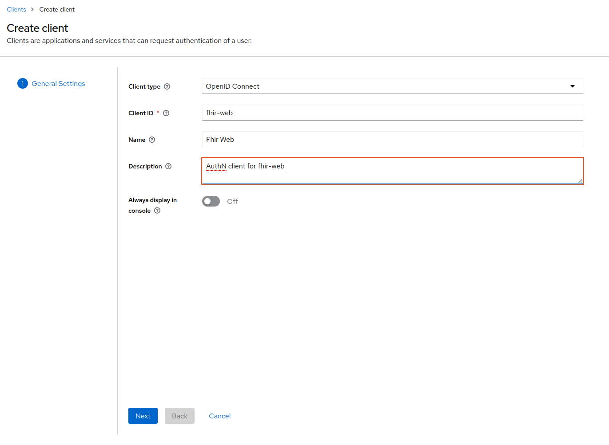 | 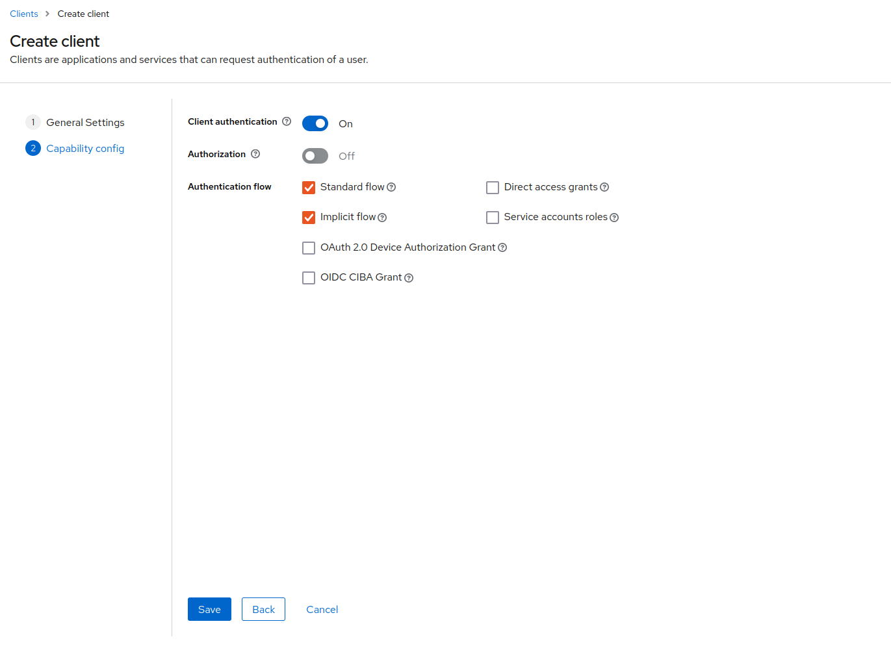 | 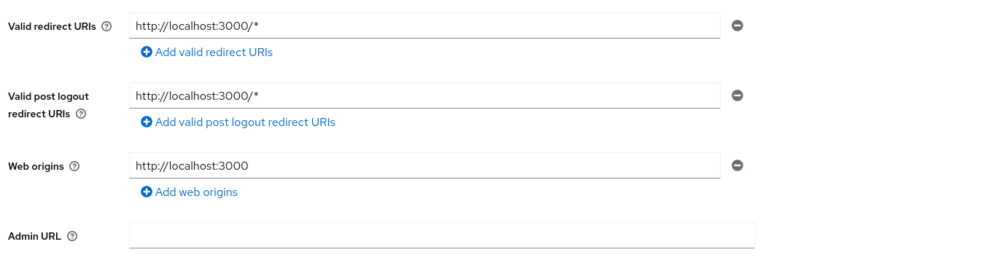 |

### Create a realm admin user account

You can use this user for keycloak administrative tasks. However, all other fhir system users should be created via the web.

|                                                  |                                                    |
| ------------------------------------------------ | -------------------------------------------------- |
| 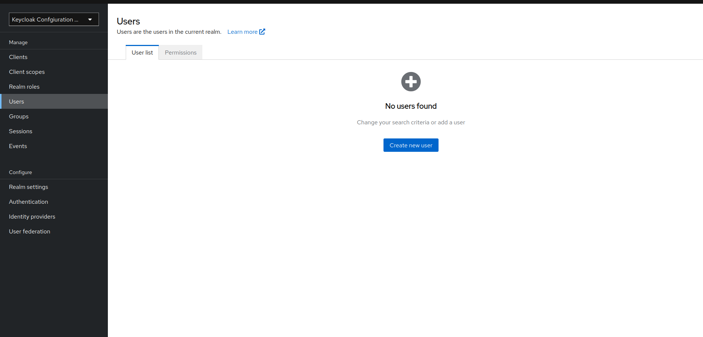 | 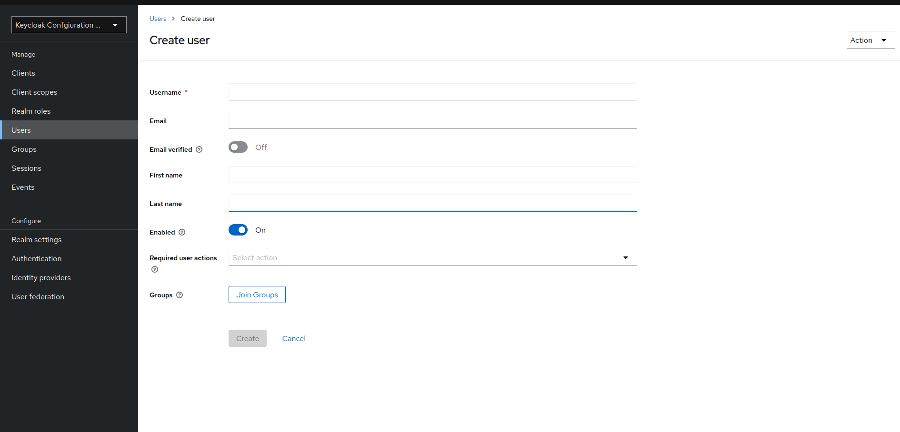 |

### Managing permissions.

At this point you can use the client credentials to run fhir-web. However, when you login with the realm admin user or any other new user, you will notice that you get a 403 Unauthorized page or that some modules are missing. This is because we have not yet assigned the user with the required permissions to view content on the web app.

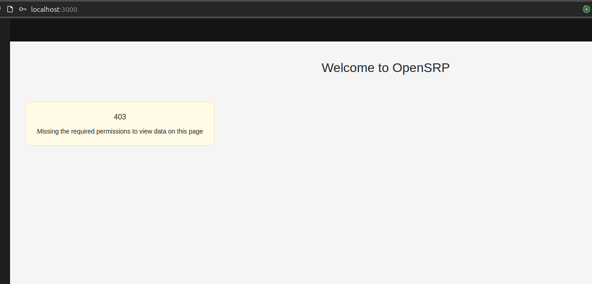

To be able to proceed we must first create the roles. We then need to assign these roles to the user by either:

1. Directly assigning roles to a user or
2. Curating roles into contextual groups and then adding users to these groups.

Note: We have 2 types of roles:

1. **Client-centric Roles.**

These effect permissions on keycloak resources like `users, and roles`. They are provided out of the box by keycloak as part of the `realm-management` client.

2. **Custom Realm roles.**

These effect permissions on Fhir resources. These should be added as realm roles, so that we can re-use the same set of roles across all the different clients. They define what permissions a user has on individual FHIR resource types

We will look at how we can create roles and groups manually using the keycloak admin web ui, and then later see what automation alternatives we can use.

#### Creating roles.

Fhir resource roles take the following shape: `<GET|POST|PUT|DELETE|MANAGE>_<FHIR_RESOURCE_NAME>`, all in caps.`MANAGE_FHIR_RESOURCE_NAME` should be created as a composite role of the of the matrix of these roles. `<GET|POST|PUT|DELETE>_<FHIR_RESOURCE_NAME>`. This [document](https://docs.google.com/document/d/1MEw41Rtfdmos9gqqDamQ31_Y58E8Thgo_8i9UXD8ET4) contains a list of roles that you can refer from.

To create roles:

1. Click on realm roles menu.
2. Then click on `Create role`

|                                               |                                                              |
| --------------------------------------------- | ------------------------------------------------------------ |
| 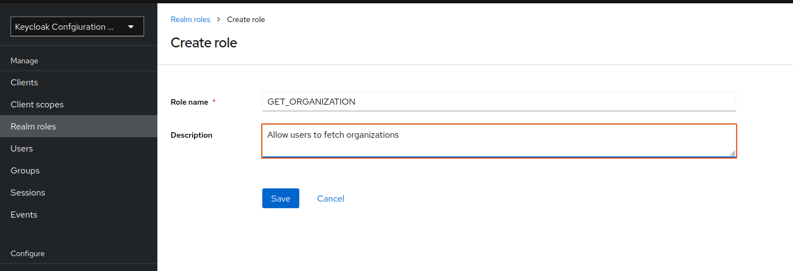 | 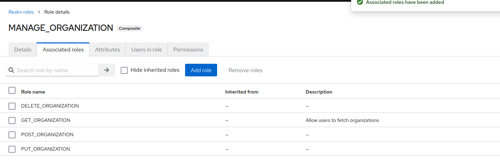 |

The second image shows a composite role `MANAGE_ORGANIZATION` that is a composite of 4 roles i.e. `GET_ORGANIZATION, PUT_ORGANIZATION, POST_ORGANIZATION, and DELETE_ORGANIZATION`

#### Creating groups.

1. Click on the Groups menu item
2. Click `Create group`, fill the form and save
3. Click on the group to open its details view.
4. Click on the `Role mapping` pill nav item,
5. Click `Assign role` to add roles to this group.

|                                                  |                                                            |
| ------------------------------------------------ | ---------------------------------------------------------- |
| 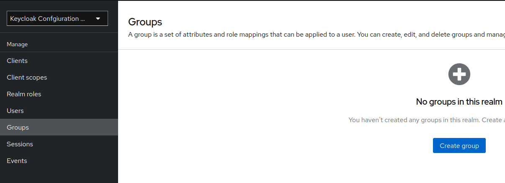 | 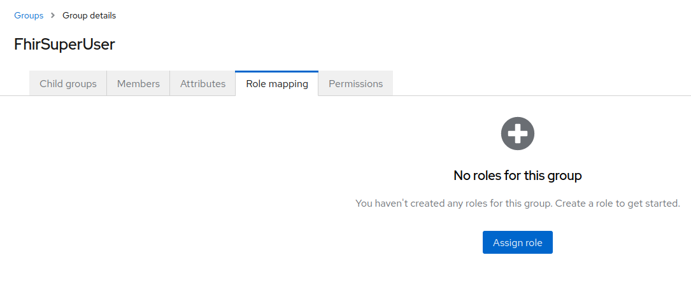 |

#### assign user to group

1. By adding members to a group.
   1. Go to groups menu
   2. click on group of interest
   3. click on the `members` pill nav item.
   4. Click on `Add member button`, and add users who you would like assigned permissions in this group. You can also remove members from the group.
2. By adding groups to a user.
   1. Go to users menu
   2. Click on the user you whose groups you would like to edit. You might have to search for the user.
   3. Click on `Groups` pill nav item
   4. Click on `Join Group` to add groups to this user. You can also revoke existing group assignments from here

Use 1 when you need to modify many users per a single group, and 2 when you have to edit several groups per user.

#### Automation

Based on the FHIR resource role's definition, it's evident that we can have upto 5 roles for each resource. Dealing with 20 resources translates to a requirement of about a 100 roles. Creating and assigning this volume of roles manually can quickly become unwieldy.

One option available is to use this [importer script](https://github.com/onaio/fhir-tooling/tree/main/importer) to create roles and asynchronously assign roles to groups.

Additionally, you can create your importer script using the [keycloak-admin-client npm package](https://www.npmjs.com/package/@keycloak/keycloak-admin-client).
[Here](<[github.com/onaio/fhir-web-e2e-docker](https://github.com/onaio/fhir-web-e2e-docker/tree/main/scripts)>) is an example that we use to bootstrap a local fhir installation for inspiration.

## Conclusion

Invalidation of any existing session and subsequent re-login to the app will no longer result in a 403 view. Instead, it should load at least one module for the user to explore. If the 403 error persists or you encounter any new errors, please create a [support issue here](https://github.com/onaio/fhir-web/issues/new/choose). Our team will assist in reviewing your setup
