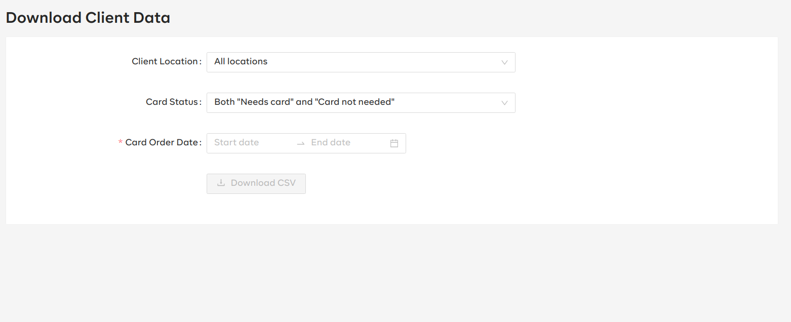

# Card Support

This package has a set of components that are used for OpenSRP card support features

## Installation

```sh
yarn add @opensrp-web/card-support
```

### Code examples

#### Download Client Data

Download client data feature, enables the user to download client data in CSV format



To make use of the download client data feature

```tsx
import { DownloadClientData } from '@opensrp-web/card-support';


...

<Route path="/download-client-data">
  <DownloadClientData opensrpBaseURL="https://opensrp-stage.smartregister.org/opensrp/rest" />
</Route>
```

`DownloadClientData` component takes the following props:

- **opensrpBaseURL:**(string)
  - **required**
  - Opensrp API base URL
