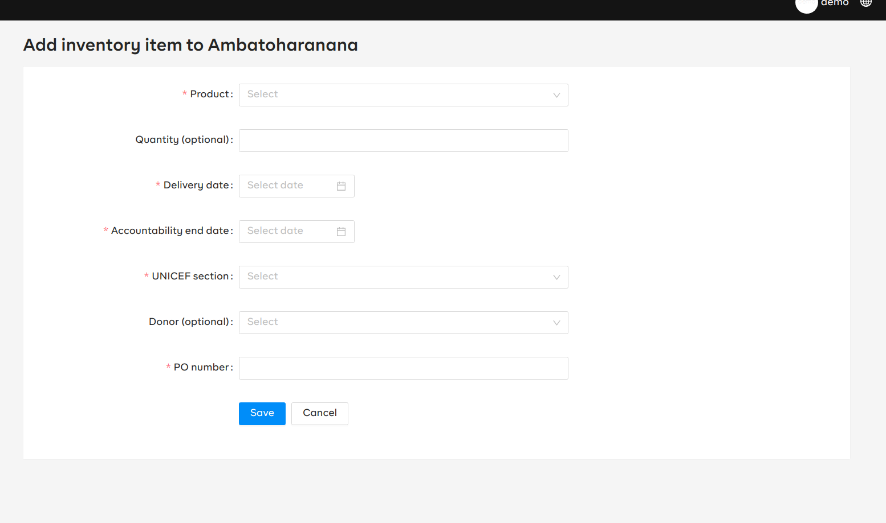

# inventory

Provides UI components and utils for managing inventory items per service point

## Installation

```sh
yarn add @opensrp-web/inventory
```

```typescript
import '@opensrp-web/inventory/dist/index.css';
```

## Usage

### Inventory Add/Edit form

Use this component to create a view for adding a new inventory item or editing an existing inventory item



To add a view for adding a new inventory item:

```tsx
import { ConnectedInventoryAddEdit, ROUTE_PARAM_SERVICE_POINT_ID } from '@opensrp-web/inventory';


const props = {
	openSRPBaseURL: 'https://opensrp-stage.smartregister.org/opensrp/rest',
  cancelURL: '/inventory',
  redirectURL: '/inventory',
}

<Route path={`/service-point/:${ROUTE_PARAM_SERVICE_POINT_ID}/inventory-item/add`}>
  <ConnectedInventoryAddEdit {...props} />
</Route>
```

**N/B** You can declare any path but make sure to include the param `ROUTE_PARAM_SERVICE_POINT_ID` in your path e.g `/foo/:${ROUTE_PARAM_SERVICE_POINT_ID}` in order to match the service point to add the inventory to

To add a view for editing an existing inventory item:

```tsx
import {
ConnectedInventoryAddEdit,
ROUTE_PARAM_SERVICE_POINT_ID,
ROUTE_PARAM_INVENTORY_ITEM_ID
} from '@opensrp-web/inventory';


const props = {
	openSRPBaseURL: 'https://opensrp-stage.smartregister.org/opensrp/rest',
  servicePointProfileURL: '/inventory/service-point',
}

<Route path={`/service-point/:${ROUTE_PARAM_SERVICE_POINT_ID}/inventory-item/edit/:${ROUTE_PARAM_INVENTORY_ITEM_ID}`}>
  <ConnectedInventoryAddEdit {...props} />
</Route>
```

**N/B** You can declare any path but make sure to include the params `ROUTE_PARAM_SERVICE_POINT_ID`, `ROUTE_PARAM_INVENTORY_ITEM_ID` in your path e.g `/foo/:${ROUTE_PARAM_SERVICE_POINT_ID}/:${ROUTE_PARAM_INVENTORY_ITEM_ID}` in order to match the service point to add the inventory to and inventory item being editted respectively.

`ConnectedInventoryAddEdit` component takes the following props:

- **opensrpBaseURL:**(string)

  - **required**
  - Opensrp API base URL

- **servicePointProfileURL:**(string)

  - **Optional**
  - Route to the service point profile view to redirect to after pressing `Cancel` button on the form to abort and exit the view or after successful submission.
  - If not provided the default is `/inventory/profile/<id>` where `id` is the id of the service point
  - If provided, the id of the service point will be added to the route name e.g if you passed `/inventory/service-point` as the `servicePointProfileURL`, the redirect will be to `/inventory/service-point/<id>`
  -

### Inventory List

To add a view for inventory list:

```tsx
import { ConnectedServicePointList } from '@opensrp-web/inventory';

const props = {
	openSRPBaseURL: 'https://opensrp-stage.smartregister.org/opensrp/rest',
}

<Route path={`/inventory`}>
  <ConnectedServicePointList {...props} />
</Route>
```

`ConnectedServicePointList` component takes the following props:

- **opensrpBaseURL:**(string)

  - **required**
  - Opensrp API base URL

### Service Point Profile

To add a view for service point profile:

```tsx
import { ServicePointProfile, INVENTORY_SERVICE_POINT_PROFILE_PARAM } from '@opensrp-web/inventory';

const props = {
	openSRPBaseURL: 'https://opensrp-stage.smartregister.org/opensrp/rest',
}

<Route path={`/inventory/:${ROUTE_PARAM_INVENTORY_ITEM_ID}`}>
  <ServicePointProfile {...props} />
</Route>
```

**N/B** You can declare any path but make sure to include the param `ROUTE_PARAM_INVENTORY_ITEM_ID` in your path e.g `/foo/:${ROUTE_PARAM_INVENTORY_ITEM_ID}`

`ServicePointProfile` component takes the following props:

- **opensrpBaseURL:**(string)

  - **required**
  - Opensrp API base URL

### Bulk Upload

To add a view for uploading inventories:

```tsx
import { BulkUpload } from '@opensrp-web/inventory';

const props = {
	openSRPBaseURL: 'https://opensrp-stage.smartregister.org/opensrp/rest',
}

<Route path={`/inventory/upload`}>
  <BulkUpload {...props} />
</Route>
```

`BulkUpload` component takes the following props:

- **opensrpBaseURL:**(string)

  - **required**
  - Opensrp API base URL
