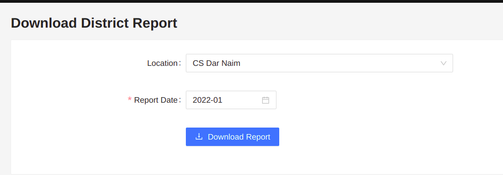

# Package

Package to download openSRP reports

## Installation

```sh
yarn add @opensrp/reports
```

## Usage

### Download District Reports

Download aggregated monthly reports per district in whichever format



### Props/ Configuration

- **opensrpBaseURL:**(string)
  - **required**
  - Opensrp API base URL

### Code examples

```tsx
import { DistrictReport } from '@opensrp/reports';


...

<Route path="/download-district-reports">
  <DistrictReport opensrpBaseURL="https://some.opensrp.url/opensrp/rest" />
</Route>
```
